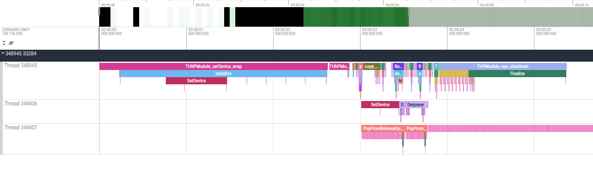

# cpp-printer

A lightweight utility for monitoring **Multithread/Multiprocess** function behavior, including call stacks, timing, frequency, and call counts.



<!-- START doctoc generated TOC please keep comment here to allow auto update -->
<!-- DON'T EDIT THIS SECTION, INSTEAD RE-RUN doctoc TO UPDATE -->
**Table of Contents**

- [cpp-printer](#cpp-printer)
  - [Quick Usage](#quick-usage)
    - [Installation](#installation)
    - [API Usage](#api-usage)
      - [`PROFILE_FUNCTION()` \& `PROFILE_RECORD("i is %d",i);`](#profile_function--profile_recordi-is-di)
      - [System Information](#system-information)
    - [env variable](#env-variable)
    - [Fast Recompile](#fast-recompile)
  - [Features](#features)
  - [Limitations](#limitations)
  - [Motivation](#motivation)
  - [Known Issues / To Do](#known-issues--to-do)

<!-- END doctoc generated TOC please keep comment here to allow auto update -->

## Quick Usage

### Installation

CMake FetchContent Usage:

```m
// if undefied symbol, maybe C++ ABI problem（default is 1）
set(CPPRINTER_USE_CXX11_ABI 0 CACHE STRING "Set to 1 to enable CXX11 ABI")

include(FetchContent)
FetchContent_Declare(
  cpp_printer # match project name
  GIT_REPOSITORY https://github.com/Kirrito-k423/cpp-printer.git
  GIT_TAG        v1.2.17
)
FetchContent_MakeAvailable(cpp_printer) # match project name

target_link_libraries(your_project PRIVATE cpprinter)
```

> [!TIP]
> You can fast find `add_library(torch_python.)` by `xxx.dir` when you compile failed like: `caffe2/torch/CMakeFiles/torch_python.dir/csrc/jit/passes/onnx.cpp.o`

> [!WARNING]
> If you use cpprinter in `install(TARGETS cpprinter EXPORT Caffe2Targets)` in `pytorch`, When you project `add_library(target_name PRIVATE pytorch)` in your project, and you add `target_link_libraries(target_name PRIVATE cpprinter)`. Because you already add cpprinter in `pytorch`, this will triger `add_library cannot create target "cpprinter" because an imported target with the same name already exists.` error.

### API Usage

#### `PROFILE_FUNCTION()` & `PROFILE_RECORD("i is %d",i);`

Simply insert `PROFILE_FUNCTION()` at the start of the function you wish to monitor. This will automatically log the function’s call stack, invocation count, and frequency.

```cpp
#include "cpprinter.hpp"
void exampleFunction() {
    PROFILE_FUNCTION(); // Automatically records function info, when `export CPPRINTER_RECORD_FUNCSTACK=1`
    // or add desc info after function name
    PROFILE_FUNCTION_WITH_DESC("_after_function_name")
    // support record some info after insert PROFILE_FUNCTION()/PROFILE_FUNCTION_WITH_DESC()
    int i=2333;
    PROFILE_RECORD("i is %d",i);
}
```

Or using icecream-plus with tid and color info

```cpp
#include "icecream_wrapper.hpp"
void exampleFunction() {
    // It seems will core dumped under some multithread situation.
    tIC(xxx); // printer the simple valiable xxx
}
```

#### System Information

To log additional system information using `PROFILE_RECORD("i is %d",i);`, you can use the following code:

```c++
#include "ProcessInfo.hpp"
PROFILE_RECORD("%s", cpprinter::process_info::ProcessInfo::getProcessInfo().c_str());
```

### env variable

| env variable               | description                                 | default |
| -------------------------- | ------------------------------------------- | ------- |
| CPPRINTER_RECORD_FUNCSTACK | Enable function stack recording             | 0       |
| CPPRINTER_OFF              | disable all cpprinter output                | 0       |
| CPPRINTER_DEBUG            | open cpprinter debug log (for myself debug) | 0       |
| CPPRINTER_CEER             | enable PROFILE_CEER("i is %d",i); printer   | 0       |

### Fast Recompile

When you add cppriner in a big CMake Project, and change the csrc of cpprinter, how to fast recompile

```bash
#=============================================================================
 # Target rules for targets named cpprinter

 # Build rule for target.
 cpprinter: cmake_check_build_system
     $(MAKE) $(MAKESILENT) -f CMakeFiles/Makefile2 cpprinter
 .PHONY : cpprinter

 # fast build rule for target.
 cpprinter/fast:
     $(MAKE) $(MAKESILENT) -f _deps/cpp_printer-build/CMakeFiles/cpprinter.dir/build.make _deps/cpp_printer-build/CMakeFiles/cpprinter.dir/build
 .PHONY : cpprinter/fast
```

* You can `rm build/_deps; make cpprinter` to redownload cpprinter and compile; Or `cd build/_deps/cpp-printer-src` to git pull the newest commit.
* Or just `make cpprinter/fast` to compile your local code change.


## Features

* [x] ~~Integrated with [icecream-cpp](https://github.com/renatoGarcia/icecream-cpp) and [cpptrace](https://github.com/jeremy-rifkin/cpptrace).~~
  * ~~Note: [icecream-cpp](https://github.com/renatoGarcia/icecream-cpp) is still under active development. You may need to update headers for new features or bug fixes.~~
* [x] Supports **multi-process/thread logging** to `/tmp/{pid}/{tid}/{fun_name}.log`.
* [ ] Planned support for Google Test integration.
* [x] virtualization with `chrome://tracing`
* [ ] virtualization with graphviz (not necessary due to callstack is not closely related)

## Limitations

* Linux-only.
  * Uses `mkdir -p` for directory creation.

## Motivation

* **Understanding Project Logic**: Running test cases provides clear insights into project flow and behavior.
* **Handling Multi-Process/Thread Environments**:
    * GDB is often cumbersome in these scenarios.
    * Logging directly with `cout` can clutter the terminal output, making it difficult to trace.

## Known Issues / To Do

* [x] ~~Compiling with `-g -O0` caused segmentation faults with `backward-cpp`. This issue has been resolved by replacing [backward-cpp](https://github.com/bombela/backward-cpp/tree/master) with [cpptrace](https://github.com/jeremy-rifkin/cpptrace).~~
* [x] ~~When integrating the [v1 code](https://github.com/Kirrito-k423/cpp-printer/releases/tag/v1.0) into a [more complex project](https://gitee.com/shaojiemike/pytorch/tree/v2.1.0/) (involving more threads and deeper function call stacks), `cpptrace` occasionally caused segmentation faults. Instead of fixing `cpptrace`, I decided to develop a simple stack trace printing feature from scratch.~~

> [!CAUTION]
> `v1.2.17` may trigger random failures, such as segmentation faults, aborts, or excessive stack trace printing. This issue occurs when cpprinter is added in a destructor function or at the end of a subthread. I am currently working on a fix.